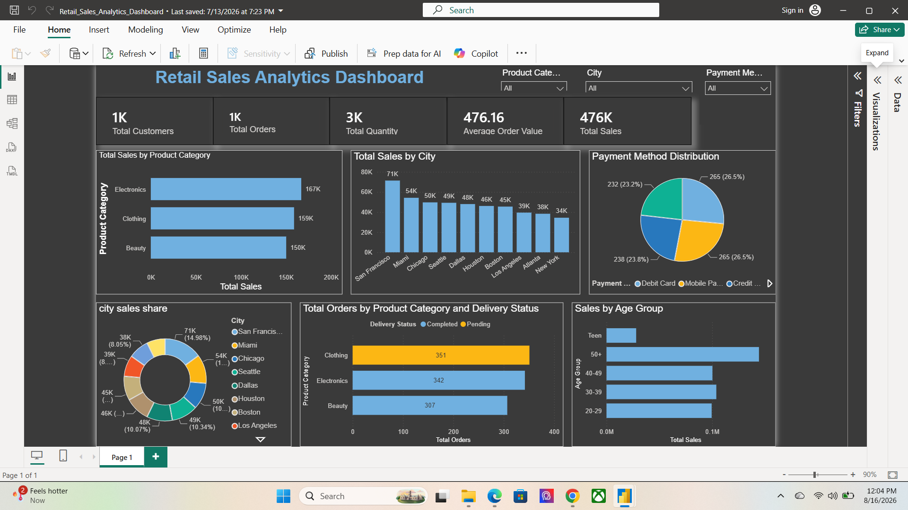

## 🖼️ Retail Sales Analytics Dashboard

## 📌 Project Overview

This project analyzes retail sales and customer transaction data to identify sales trends, customer behavior, product performance, regional performance, and payment preferences.

The goal is to transform raw transactional data into meaningful business insights that can help improve sales performance and customer understanding.

---

## 🎯 Project Objective

The main objectives of this project are:

- Analyze overall sales performance
- Identify top-performing products and categories
- Analyze sales across different regions
- Understand customer behavior and customer types
- Analyze payment method preferences
- Identify sales trends over time
- Generate actionable business recommendations

---

## 📂 Dataset Description

The dataset contains retail transaction information, including:

- Date
- Product
- Category
- Region
- Customer Type
- Payment Method
- Quantity
- Unit Price
- Total Sales
- Revenue

The dataset was cleaned and prepared before performing the analysis.

---

## 🧹 Data Cleaning

The following data preparation steps were performed:

- Checked for missing values
- Checked for duplicate records
- Corrected data types
- Standardized categorical values
- Checked numerical values
- Verified sales calculations
- Prepared the dataset for SQL and Power BI analysis

---


## 📊 Power BI Dashboard

An interactive Power BI dashboard was created to visualize sales and customer insights.

### Dashboard includes:

- Total Sales
- Total Orders
- Quantity Sold
- Average Order Value
- Monthly Sales Trend
- Sales by Category
- Sales by Region
- Top Products
- Customer Type Analysis
- Payment Method Analysis
- Interactive Filters/Slicers

---

## 💡 Business Recommendations

Based on the analysis, the business can:

- Focus marketing efforts on high-performing products
- Improve strategies for weaker-performing regions
- Target valuable customer segments
- Promote products with strong customer demand
- Use customer behavior to improve marketing campaigns
- Encourage repeat purchases and customer retention

---

## 🛠️ Tools Used

| Tool | Purpose |
|---|---|
| Excel | Data preparation and analysis |
| Power BI | Dashboard and visualization |
| GitHub | Project documentation and version control |

---

## 🖼️ Dashboard Screenshot



---

## 📁 Project Structure

```text
sales-customer-insights/
│
├── Dataset/
│   └── Data_Set.csv
│
├── PowerBI/
│   └── Sales_Customer_Insights.pbix
│
├── Dashboard/
│   └── dashboard.png
│
└── README.md
